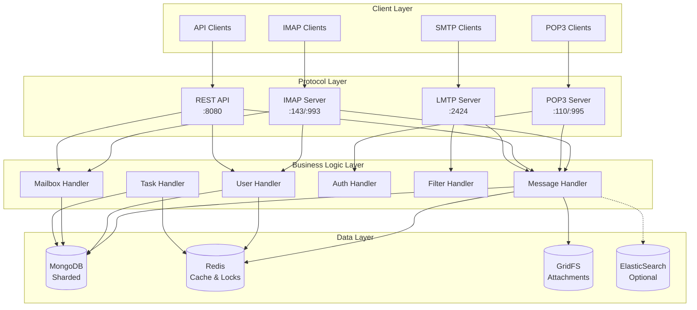
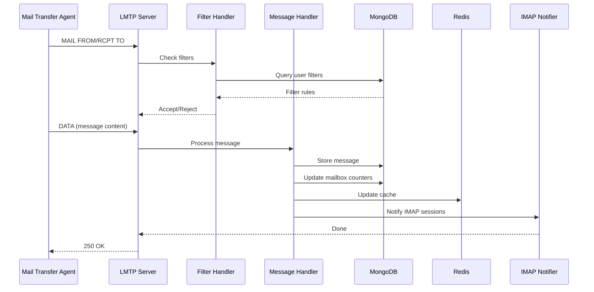
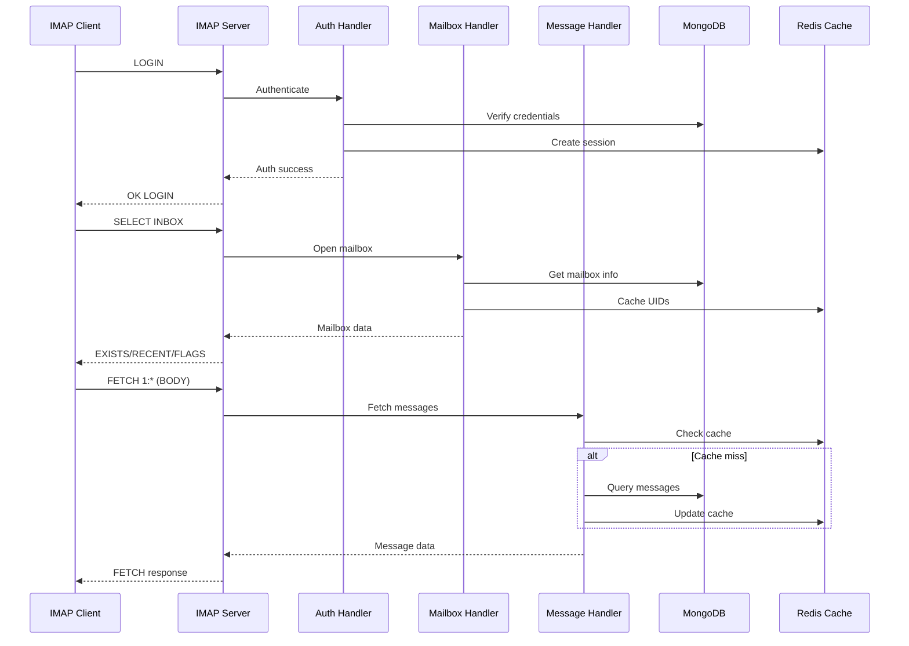
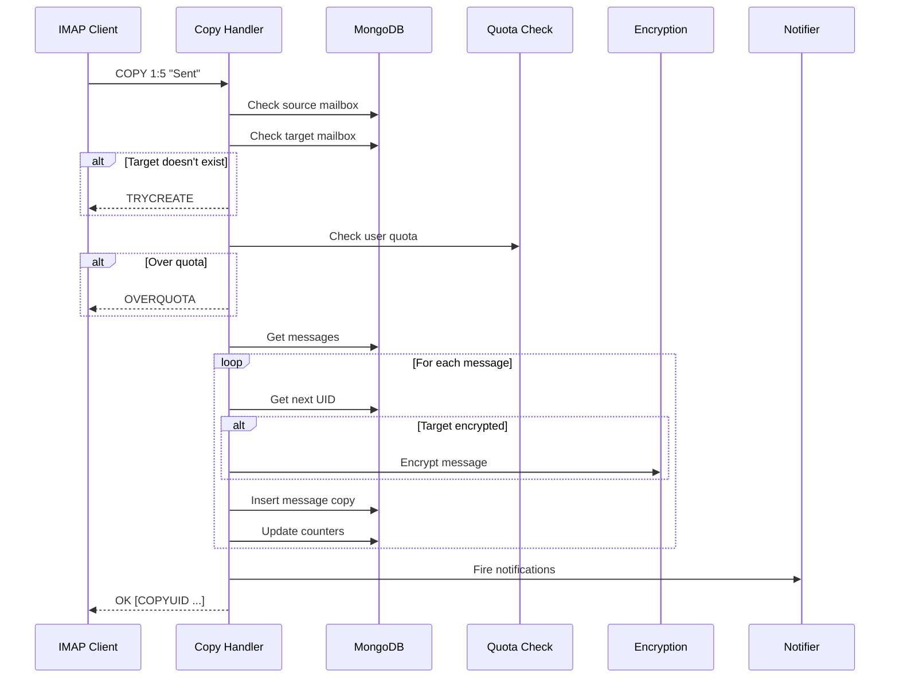
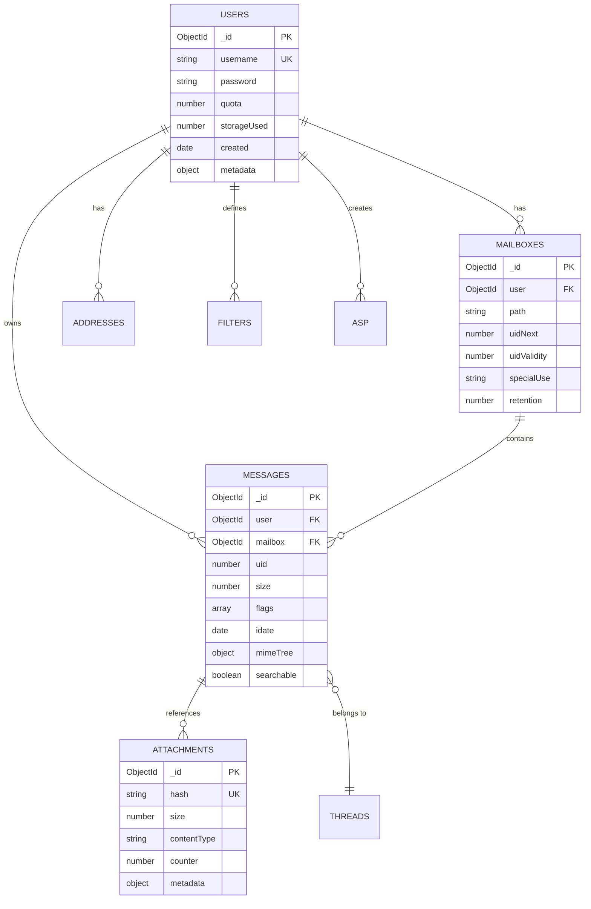
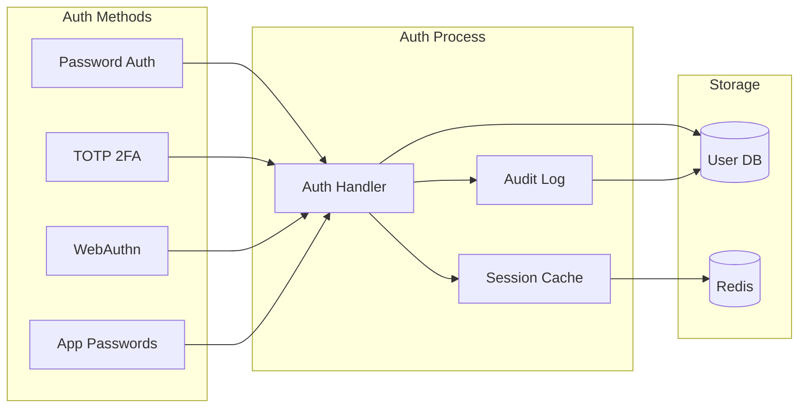

# WildDuck Architecture Documentation

## System Overview

WildDuck is a distributed, scalable email server that stores all data (including emails) in MongoDB and uses Redis for caching and real-time operations.

## Architecture Layers



## Data Flow Patterns

### 1. Message Reception (LMTP)



### 2. IMAP Message Retrieval



### 3. Message Copy Flow (IMAP COPY)



## Database Schema Design

### Collections Relationship



## Component Responsibilities

### Core Services

| Component       | Responsibility                           | Key Files                |
| --------------- | ---------------------------------------- | ------------------------ |
| **IMAP Server** | Handle IMAP protocol, session management | `imap.js`, `imap-core/`  |
| **POP3 Server** | Handle POP3 protocol                     | `pop3.js`, `lib/pop3/`   |
| **LMTP Server** | Receive incoming mail                    | `lmtp.js`                |
| **API Server**  | REST API for management                  | `api.js`, `lib/api/`     |
| **Task Runner** | Background jobs (cleanup, quotas)        | `tasks.js`, `lib/tasks/` |
| **Indexer**     | Search indexing, message parsing         | `indexer.js`             |
| **Notifier**    | Real-time IMAP notifications             | `lib/imap-notifier.js`   |

### Handler Modules

| Handler            | Purpose                    | Database Collections        |
| ------------------ | -------------------------- | --------------------------- |
| **MessageHandler** | Message CRUD operations    | messages, attachments.files |
| **UserHandler**    | User management, auth      | users, addresses            |
| **MailboxHandler** | Mailbox operations         | mailboxes                   |
| **FilterHandler**  | Message filtering          | filters                     |
| **AuditHandler**   | Audit logging              | audit                       |
| **DkimHandler**    | DKIM key management        | dkim                        |
| **CertHandler**    | TLS certificate management | certs                       |

## Scaling Strategy

### Horizontal Scaling

```yaml
# Docker Compose Example
services:
    wildduck-1:
        image: wildduck
        environment:
            - PROCESSES=4
        deploy:
            replicas: 3

    mongodb:
        image: mongo
        command: mongod --shardsvr --replSet shard1
        deploy:
            replicas: 3

    redis:
        image: redis
        command: redis-server --cluster-enabled yes
        deploy:
            replicas: 6
```

### Load Distribution

1. **Process Level**: Multi-process using Node.js cluster
2. **Instance Level**: Multiple WildDuck instances behind load balancer
3. **Database Level**: MongoDB sharding for data distribution
4. **Cache Level**: Redis Cluster for session distribution

## Security Architecture

### Authentication Flow



### Encryption Layers

1. **Transport**: TLS/SSL for all protocols
2. **Storage**: Optional PGP encryption for messages
3. **Passwords**: PBKDF2/bcrypt hashing
4. **Tokens**: Encrypted with configurable secret
5. **Attachments**: Deduplicated and optionally encrypted

## Performance Optimizations

### Caching Strategy

| Cache Type   | Location | TTL       | Purpose              |
| ------------ | -------- | --------- | -------------------- |
| Session      | Redis    | 1 hour    | User sessions        |
| Mailbox      | Redis    | 5 min     | Mailbox metadata     |
| Message list | Redis    | 1 min     | UID lists            |
| User data    | Memory   | 30 sec    | Frequent lookups     |
| Attachment   | GridFS   | Permanent | Deduplicated storage |

### Database Indexes

Critical indexes for performance:

- `users`: username, address
- `messages`: mailbox+uid, user+searchable
- `mailboxes`: user+path
- `attachments.files`: hash

## Monitoring Points

### Key Metrics

```javascript
// Health check endpoints
GET /health         // Basic health
GET /health/details // Detailed status

// Metrics to monitor
{
    "connections": {
        "imap": 125,
        "pop3": 23,
        "api": 45
    },
    "database": {
        "connected": true,
        "latency": 2.5
    },
    "redis": {
        "connected": true,
        "memory": "125MB"
    },
    "queues": {
        "tasks": 12,
        "webhooks": 3
    },
    "storage": {
        "used": "45.2GB",
        "attachments": 125000
    }
}
```

## Deployment Considerations

### Minimum Requirements

- **MongoDB**: 4.0+ with replica set
- **Redis**: 5.0+ (6.0+ for ACLs)
- **Node.js**: 16.0+
- **RAM**: 2GB minimum, 4GB recommended
- **Storage**: SSD recommended for database

### Production Checklist

- [ ] Configure MongoDB replica set
- [ ] Enable MongoDB authentication
- [ ] Setup Redis persistence
- [ ] Configure TLS certificates
- [ ] Set user/group for process
- [ ] Configure log rotation
- [ ] Setup monitoring
- [ ] Configure backups
- [ ] Set resource limits
- [ ] Enable audit logging

## Extension Points

### Plugin System

```javascript
// Plugin structure
module.exports = {
    title: 'My Plugin',
    init: (app, done) => {
        // Plugin initialization
        done();
    },
    hooks: {
        'message:store': (envelope, body, next) => {
            // Process message before storage
            next();
        },
        'user:created': (user, next) => {
            // Handle new user
            next();
        }
    }
};
```

### Custom Handlers

Add custom IMAP commands:

1. Create handler in `lib/handlers/`
2. Register in `imap.js`
3. Add tests in `test/`

### API Extensions

Add new API endpoints:

1. Create handler in `lib/api/`
2. Define schemas in `lib/schemas/`
3. Update OpenAPI documentation
